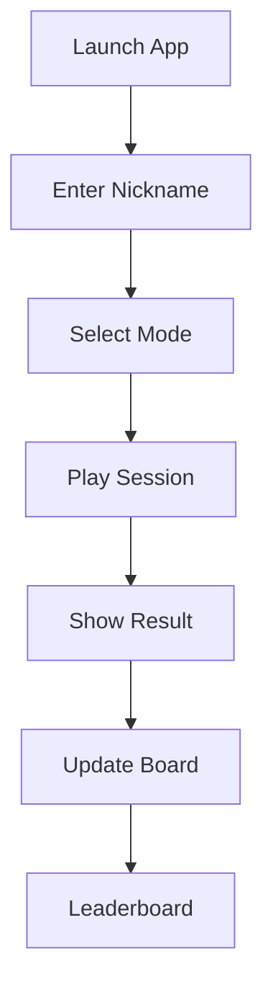
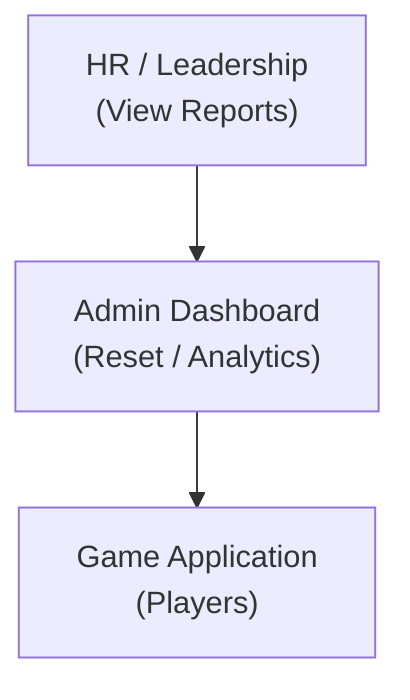

## PowerPlay Tic-Tac-Toe Application

Business Requirements Document (BRD)
Version: 1.3
Date: October 2025
Author: Business Analyst (Intertech)
Status: Final Approved

## Table of Contents

1. [Introduction](#1-introduction)
2. [Business Objectives](#2-business-objectives)
3. [Project Scope](#3-project-scope)
4. [Use Cases](#4-use-cases)
5. [Stakeholders](#5-stakeholders)
6. [Interface Requirements](#6-interface-requirements)
7. [Business Rules](#7-business-rules)
8. [Business Rules Traceability](#8-business-rules-traceability)
9. [Assumptions and Dependencies](#9-assumptions-and-dependencies)
10. [Constraints and Limitations](#10-constraints-and-limitations)
11. [Risks and Mitigation Strategies](#11-risks-and-mitigation-strategies)
12. [Acceptance Criteria and Success Metrics](#12-acceptance-criteria-and-success-metrics)
13. [Post-Implementation Support and Maintenance](#13-post-implementation-support-and-maintenance)
14. [Approvals and Sign-Off](#14-approvals-and-sign-off)
15. [Glossary and Acronyms](#15-glossary-and-acronyms)
16. [Change Summary (v1.2 Updates)](#16-change-summary-v12-updates)

**Appendices**
- [Appendix A – Future Enhancements](#appendix-a--future-enhancements)
- [Appendix B – Supporting Artifacts and References](#appendix-b--supporting-artifacts-and-references)

---

---

## **Executive Summary**

The *PowerPlay Tic-Tac-Toe* application embodies PowerPlay Software’s spirit of innovation and community.
Created as an internal engagement initiative, it demonstrates how simple digital experiences can strengthen connections across teams while reinforcing PowerPlay’s values of collaboration and curiosity.

This browser-based game lets employees challenge each other or an AI opponent, earn leaderboard recognition, and share in friendly competition.
Beyond fun, it symbolizes how PowerPlay rapidly ideates and delivers modern solutions through experimentation and cross-functional teamwork.
The project culminates in the **Year-End Innovation Celebration 2025**, serving as a showcase for creativity and technical excellence.

---

## **1. Introduction**

### 1.1 Purpose

This Business Requirements Document (BRD) defines, in business terms, the objectives, scope, and capabilities of the PowerPlay Tic-Tac-Toe application. It serves as a shared understanding between PowerPlay Software and Intertech for project planning, development, testing, and deployment. The document establishes the baseline for what will be delivered, how success will be measured, and which constraints apply.

### 1.2 Background

PowerPlay Software has a long-standing focus on employee engagement. In 2025, the company initiated a “Micro-Innovation Challenge” to encourage small, creative projects that foster collaboration and showcase internal innovation. The Tic-Tac-Toe application was conceived as a fun, low-barrier activity that connects employees through play and friendly competition while demonstrating the organization’s ability to quickly deliver digital solutions.

### 1.3 Project Overview

The project will deliver a browser-based Tic-Tac-Toe game hosted in PowerPlay’s Azure environment.
Players will compete against each other or an AI opponent, and results will populate a company-wide leaderboard.

An administrative dashboard will enable authorized users to manage leaderboards and view engagement analytics.

### 1.4 Objectives

* Promote Collaboration: Encourage cross-departmental interaction through shared play.
* Demonstrate Innovation: Showcase PowerPlay’s agility in delivering modern applications.
* Foster Engagement: Provide a positive and inclusive experience for employees.
* Deliver Analytics: Provide leadership with data on participation and engagement.
* Ensure Simplicity: Accessible through any modern browser without training.

### 1.5 Business Need

Surveys show employees want more light-hearted opportunities for connection, especially in hybrid and remote settings. The Tic-Tac-Toe application addresses this need by offering a safe, inclusive, and easy-to-use platform for friendly competition. Its success will be measured through usage statistics, survey feedback, and participation rates during the Year-End Innovation Celebration 2025.

### 1.6 Stakeholders

| **Role / Title**  | **Name / Group**                     | **Responsibilities**                          |
| :---------------- | :----------------------------------- | :-------------------------------------------- |
| Executive Sponsor | Chief Technology Officer (CTO)       | Champion initiative, approve funding.         |
| Business Owner    | Chief Human Resources Officer (CHRO) | Own engagement objectives, coordinate launch. |
| Program Lead      | Head of Innovation Programs          | Align with corporate innovation strategy.     |
| IT Operations     | PowerPlay IT Department              | Host and maintain Azure environment.          |
| Vendor Partner    | Intertech                            | Deliver solution and support handoff.         |
| End Users         | All PowerPlay Employees              | Play games and provide feedback.              |

### 1.7 Project Deliverables

| **Deliverable**            | **Description**                       | **Acceptance Owner**     |
| :------------------------- | :------------------------------------ | :----------------------- |
| Functional Web Application | Browser game with AI and leaderboard. | HR / Innovation Programs |
| Admin Dashboard            | Reset scores and view analytics.      | IT / HR                  |
| Documentation              | Quick-start and admin guides.         | IT Ops                   |
| Analytics Reports          | Participation summaries and metrics.  | HR                       |
| Handoff Package            | Source code and deployment notes.     | IT Ops                   |

### 1.8 Success Criteria

* Launch no later than December 1, 2025.
* ≥ 40 % employee participation within 30 days.
* Average user satisfaction ≥ 4.0 / 5.
* ≥ 99.5 % uptime first 60 days.
* Zero critical defects post-launch.
---

## **2. Requirements Scope**

### 2.1 Business Scope

The application supports PowerPlay’s goal of enhancing internal connection and innovation culture.
It is a non-revenue internal project sponsored by the CHRO and CTO and managed by the Innovation Programs team.

#### 2.1.1 User Personas and Behavior Patterns

This section defines the key user types who will interact with the PowerPlay Tic-Tac-Toe application, their motivations, behavior patterns, and how the system must accommodate their needs.

##### Casual Player "Social Sarah"
- Profile: Non-technical employee seeking quick breaks and team connection
- Behavior: Plays 2-3 short games per day during breaks
- Needs: Simple interface, quick game completion, easy opponent finding
- Success Metrics: Completes games in ≤ 5 minutes, returns daily

##### Competitive Player "Tournament Tom" 
- Profile: Highly engaged employee tracking stats and rankings
- Behavior: Multiple daily sessions, studies AI strategies
- Needs: Accurate leaderboard, skill progression, challenging AI
- Success Metrics: Improves win rate over time, high participation

##### Department Lead "Manager Maria"
- Profile: Uses game for team building and engagement
- Behavior: Organizes informal tournaments, tracks participation
- Needs: Department statistics, engagement metrics
- Success Metrics: Increased team interaction, positive feedback

##### New Employee "Onboarding Oliver"
- Profile: Recent hire looking to connect with colleagues
- Behavior: Uses game to break ice with new teammates
- Needs: Welcoming environment, simple nickname setup
- Success Metrics: Makes connections through gameplay

##### Occasional User "Busy Bob"
- Profile: Time-constrained employee with sporadic availability
- Behavior: Quick games between meetings, primarily vs AI
- Needs: Fast loading, interruption-friendly gameplay
- Success Metrics: Completes games despite schedule

These personas inform feature priorities and success metrics throughout this document. They represent the spectrum of expected usage patterns and engagement levels among PowerPlay employees.


### 2.2 In Scope

* Classic 3×3 Tic-Tac-Toe play mode (PvP and AI).
* Nickname entry and validation.
* Leaderboard tracking wins, losses, draws.
* AI difficulty settings (Easy / Medium / Hard).
* Administrative console for reset and reports.
* Analytics dashboard showing engagement statistics.
* Browser support for Edge v120+ and Chrome v120+.
* Azure-based deployment and data storage.

### 2.3 Out of Scope

* Mobile apps (iOS / Android).
* Integration with HR systems or SSO.
* Collection of personal identifiable data (PII).
* Accessibility beyond keyboard navigation.
* Advanced AI learning or multiplayer chat.

### 2.4 Assumptions

* All users access via corporate network or VPN.
* Participation is voluntary.
* No PII stored.
* Azure resources and support available through IT Ops.

### 2.5 Dependencies

* Azure App Service and SQL Database availability.
* Corporate browser standards policy.
* IT support for deployment and backups.
* HR communications for promotion.

### 2.6 Constraints

* Delivery deadline December 1, 2025.
* Fixed innovation budget.
* Limited scope (no mobile release in v1).
* Internal use only (no external traffic).
---

## **3. Functional Requirements**


### 3.2 Detailed Use Cases

#### Use Case: Start Game

Actors: Player
##### Main Flow:
Player opens URL and sees welcome screen within 5 seconds.
Player enters nickname (required).
Player selects game mode (PvP or AI).
System renders 3×3 grid.
Player 1 (X) begins; system alternates turns.
System detects win or draw and displays message ≤ 0.5 s.
Player may reset board.

Alternate Flow:
If nickname missing → prompt user for entry.

##### Acceptance Criteria:

Grid renders ≤ 2 s.
Result message appears ≤ 0.5 s.
Reset clears board instantly.

#### Use Case: Play vs AI

Actors: Player, AI Opponent

##### Main Flow:
Player selects “Play vs AI.”
Chooses difficulty (Easy / Medium / Hard).
Player makes first move; AI responds ≤ 1 s.
Game continues until win or draw.

##### Acceptance Criteria:

AI response ≤ 1 s.
Difficulty affects move quality immediately.
No invalid or skipped turns.

#### Use Case: View Leaderboard

Actors: Player

##### Main Flow:
Player accesses Leaderboard tab.
System displays nicknames, total games, wins, win rate.
Data refreshes automatically at end of every game.

##### Acceptance Criteria:

Sorted by wins → win rate → games played.
Updates visible to all active sessions.

#### Use Case: Analytics Dashboard

Actors: Administrator

##### Main Flow:

Admin logs into dashboard.
System shows metrics: total games, unique players, AI usage, win/draw rates, device types.
Admin filters by date range or difficulty.
Admin exports data to CSV.

##### Acceptance Criteria:

Dashboard loads ≤ 3 s.
Export produces valid CSV.
Filters work instantly.


### 3.3 Functional Flow Diagram


<!-- Fallback ASCII diagram for renderers without Mermaid support
```
 ┌───────────────┐
 │ Launch App    │
 └──────┬────────┘
        ▼
 ┌───────────────┐
 │ Enter Nickname│
 └──────┬────────┘
        ▼
 ┌───────────────┐
 │ Select Mode   │
 └──────┬────────┘
        ▼
 ┌───────────────┐
 │ Play Session  │
 └──────┬────────┘
        ▼
 ┌───────────────┐
 │ Show Result   │
 └──────┬────────┘
        ▼
 ┌───────────────┐
 │ Update Board  │
 └──────┬────────┘
        ▼
 ┌───────────────┐
 │ Leaderboard   │
 └───────────────┘
-->


### 3.4 Functional Requirements Traceability

Each requirement (FR) has a unique ID for traceability.

| ID     | Requirement         | Description                                            |
| :----- | :------------------ | :----------------------------------------------------- |
| FR-001 | Launch Application  | Users can open the URL and see home screen within 5 s. |
| FR-002 | Enter Nickname      | Player must enter nickname before starting game.       |
| FR-003 | Select Game Mode    | Player chooses PvP or AI mode.                         |
| FR-004 | Set AI Difficulty   | Select Easy / Medium / Hard for AI mode.               |
| FR-005 | Play Game Session   | System renders 3×3 grid; players alternate turns.      |
| FR-006 | Validate Moves      | Reject moves to occupied cells.                        |
| FR-007 | Detect Win/Draw     | Auto-detect three-in-a-row and display result ≤ 0.5 s. |
| FR-008 | Restart Game        | Player can reset board any time.                       |
| FR-009 | Update Leaderboard  | Record result and update leaderboard instantly.        |
| FR-010 | Admin Controls      | Admin can reset leaderboard and remove nicknames.      |
| FR-011 | Analytics Dashboard | Admin views metrics (games, unique players, AI usage). |
| FR-012 | Export Reports      | Dashboard supports CSV export.                         |


## **4. Non-Functional Requirements (NFRs)**

| ID      | Category           | Requirement                                    |
| :------ | :----------------- | :--------------------------------------------- |
| NFR-001 | Performance        | Load ≤ 5 s; AI response ≤ 1 s.                 |
| NFR-002 | Usability          | Game playable without training.                |
| NFR-003 | Scalability        | ≥ 500 concurrent sessions.                     |
| NFR-004 | Reliability        | 99.5 % uptime business hours.                  |
| NFR-005 | Security           | HTTPS TLS 1.2+; no PII.                        |
| NFR-006 | Maintainability    | Configurable via Azure App Settings.           |
| NFR-007 | Accessibility      | Keyboard navigation supported.                 |
| NFR-008 | Brand Compliance   | PowerPlay blue #0F62FE / gray #E5E5E5 / white. |
| NFR-009 | Compatibility      | Edge v120+ / Chrome v120+.                     |
| NFR-010 | Backup             | Daily Azure SQL backups.                       |
| NFR-011 | Audit Logging      | Admin actions timestamped, 12 mo retention.    |
| NFR-012 | Compliance         | Meets PowerPlay IT policy.                     |
| NFR-013 | Localization       | English only.                                  |
| NFR-014 | Error Handling     | Plain-language messages.                       |
| NFR-015 | Monitoring         | Azure Insights for uptime/errors.              |
| NFR-016 | Recovery           | RTO ≤ 4 h; RPO ≤ 24 h.                         |
| NFR-017 | Retention          | 12 mo per policy.                              |
| NFR-018 | Testability        | All requirements verifiable in UAT.            |
| NFR-019 | Sustainability     | Uses existing Azure resources.                 |
| NFR-020 | Documentation      | Quick-start and admin guides delivered.        |
| NFR-021 | Supportability     | IT Help Desk Level 1 support.                  |
| NFR-022 | Availability       | Maintenance after hours only.                  |
| NFR-023 | Legal              | Open-source libs MIT or equiv.                 |
| NFR-024 | Data Quality       | Leaderboard updates atomically.                |
| NFR-025 | Analytics Latency  | Dashboard refresh ≤ 60 s.                      |
| NFR-026 | UI Responsiveness  | Layout ≥ 768 px width.                         |
| NFR-027 | Maintenance Window | Planned outage ≤ 2 h monthly.                  |
| NFR-028 | Policy Review      | Annual security audit.                         |
| NFR-029 | Interoperability   | Exports open in Excel.                         |
| NFR-030 | Logging            | Error logs retained 30 days.                   |
| NFR-031 | Governance         | Sponsor approval for scope changes.            |
| NFR-032 | End-of-Life        | Review after 24 months.                        |

---

## **5. Data Requirements**

### 5.1 Data Inputs

| Source | Data Element  | Purpose                        | Validation                             |
| :----- | :------------ | :----------------------------- | :------------------------------------- |
| Player | Nickname      | Identify player on leaderboard | 1–20 chars (letters/numbers/-/_/space) |
| Player | Game Mode     | Select PvP or AI               | Required                               |
| Player | AI Difficulty | Set challenge level            | Defaults Medium                        |
| System | Moves         | Track X/O positions            | Empty cell only                        |
| System | Timestamp     | Record start/end               | Auto-generated                         |
| Admin  | Reset Action  | Confirm leaderboard clear      | “Yes” confirmation                     |

### 5.2 Data Outputs

| Audience | Data               | Purpose                | Format           |
| :------- | :----------------- | :--------------------- | :--------------- |
| Player   | Result             | Show Win/Loss/Draw     | On-screen        |
| Player   | Leaderboard        | Rank nicknames         | Sortable table   |
| Admin    | Analytics          | Games played, AI usage | Charts           |
| Admin    | Audit Log          | Admin actions          | Table + CSV      |
| HR       | Engagement Summary | Participation overview | Aggregate report |

### 5.3 Data Retention and Purging

* Game + leaderboard data kept 12 months.
* Audit logs kept 12 months.
* Aggregate analytics kept indefinitely (no PII).
* Deletion via scheduled IT task.

### 5.4 Data Privacy and Sensitivity

* No PII collected.
* Nicknames display-only.
* Access restricted to admins.

### 5.5 Data Quality and Integrity

* Leaderboard updates transactional.
* Duplicate nicknames handled gracefully.
* Reset clears records completely.

**Figure 2 – Data Flow Overview**

```
 ┌────────────────────┐
 │ Players (Employees)│
 └──────┬─────────────┘
        │ Nickname, Moves
        ▼
 ┌────────────────────┐
 │ Tic-Tac-Toe System│
 │ (Game, Logic, DB) │
 └──────┬─────────────┘
        │ Results & Scores
        ▼
 ┌────────────────────┐
 │ Leaderboard View │
 └──────┬─────────────┘
        │ Analytics Data
        ▼
 ┌────────────────────┐
 │ Admin Dashboard │
 └──────┬─────────────┘
        │ Reports
        ▼
 ┌────────────────────┐
 │ HR / Leadership │
 └────────────────────┘
```


---

## **6. Interface Requirements**

### 6.1 Overview

This section describes the interfaces between users and the PowerPlay Tic-Tac-Toe system.
Interfaces include:

* The Player User Interface (UI) for all employees.
* The Administrative Console for authorized staff.
* The Browser Interface, defining supported environments.
* The Reporting Interface, which provides analytics and exports.
* Each interface must adhere to PowerPlay’s accessibility, usability, and security standards and follow the brand’s visual identity.

### 6.2 Player User Interface

| Feature | Description | Business Purpose | Acceptance Criteria |
| --- | --- | --- | --- |
| Home Screen | Displays logo, brief instructions, and nickname input. | Simplifies onboarding. | Visible ≤ 5 s after page load. |
| Mode Selection | Toggle between Player vs Player and Player vs AI; select AI difficulty. | Enables flexible play. | Dropdown/toggle works on keyboard and mouse. |
| Game Board | 3 × 3 grid; shows X/O moves in real time. | Core gameplay. | Grid responds instantly to valid clicks; occupied cells blocked. |
| Turn Indicator | Displays current player or “AI Thinking…” status. | Clarifies flow. | Always visible; updates ≤ 1 s after AI move. |
| Reset Button | Clears current game instantly. | Allows replay. | Board resets and timer restarts within 1 s. |
| Leaderboard Button | Opens leaderboard table. | Encourages competition. | Loads within 2 s and sortable by wins. |

#### Design Standards
Colors: PowerPlay Blue (#0F62FE), Gray (#E5E5E5), White.
Typography: Segoe UI 12 pt body / 16 pt headers.
Layout: Centered grid with sidebar for score and mode selection.
Responsiveness: Optimized for ≥ 768 px width (desktop/tablet).
Accessibility: All controls keyboard-operable; focus states visible.

### 6.3 Administrative Interface

| Component | Functionality | Security Control | Notes |
| --- | --- | --- | --- |
| Login Screen | Password-protected entry to Admin Console. | Credential stored in Azure Key Vault; HTTPS only. | Single admin credential per environment. |
| Leaderboard Management | Reset leaderboard or remove nicknames. | Requires confirmation dialog. | Reset action logged in Audit Log. |
| Analytics Dashboard | Displays games played, unique players, AI usage, average duration. | Read-only charts; no manual data edits. | Filters by date and difficulty. |
| Audit Log Viewer | Shows admin actions (timestamp, action type, user). | Read-only. | Exportable to CSV. |

### 6.4 Browser Interface

* Supported browsers: Microsoft Edge v120+ and Google Chrome v120+.
* Layout must remain consistent on window resize.
* Application communicates only via HTTPS (TLS 1.2 or higher).
* No browser plug-ins or extensions required.
* Cookie-less session handling preferred; use local storage for nickname.
* Must gracefully degrade if JavaScript disabled (show friendly message).

### 6.5 Reporting Interface

| Report Name | Description | Frequency | Recipients |
| --- | --- | --- | --- |
| Engagement Summary | Totals games played, unique nicknames, top players. | Weekly / Monthly | HR & Leadership |
| Operational Metrics | System uptime, error rates, concurrent users. | Monthly | IT Operations |
| Audit Export | List of admin actions. | On Demand | Compliance / Security |

* Reports exportable in CSV format.
* Charts refresh automatically every 60 seconds.
* Dashboards must display filters for date range and AI difficulty.

### 6.6 Interface Diagram

Figure 3 – Interface Overview



## 6.7 Non-Functional Interface Standards

| Category | Requirement |
| :--- | :--- |
| Performance | Each interface loads within 3 seconds (95 th percentile). |
| Security | All UI components served over HTTPS; admin screens require authentication. |
| Usability | Average user completes first game in ≤ 5 minutes unaided. |
| Reliability | Interface availability ≥ 99.5 % business hours. |
| Brand Consistency | Fonts, colors, and spacing align with PowerPlay visual standards. |
| Localization | English only (v1). |


## 6.8 Feature Priority and Value Matrix

This matrix identifies the priority and value of each major feature to guide backlog creation and sprint planning.

| Feature | Business Value | Release Phase | Primary Objectives | Value Rationale |
| :--- | :---: | :--- | :--- | :--- |
| Core Game Engine | Critical | MVP | OBJ-01, OBJ-05 | Foundational gameplay; enables all other features |
| Nickname System | Critical | MVP | OBJ-01, OBJ-03 | Enables player identification and engagement tracking |
| Easy AI Opponent | High | MVP | OBJ-02, OBJ-03 | Initial single-player experience; demonstrates innovation |
| Basic Leaderboard | High | MVP | OBJ-03, OBJ-04 | Drives engagement through competition |
| Admin Authentication | High | MVP | OBJ-04, OBJ-05 | Required for system management and data protection |
| Advanced AI Levels | Medium | R1 | OBJ-02 | Enhances gameplay depth and challenge |
| Analytics Dashboard | Medium | R1 | OBJ-04 | Provides insights for leadership |
| Department Rankings | Medium | R1 | OBJ-01, OBJ-03 | Encourages cross-department interaction |
| Content Moderation | Low | R2 | OBJ-05 | Maintains professional environment |
| Extended Statistics | Low | R2 | OBJ-04 | Deeper analytics for future planning |

Business Value Key:
- Critical: Essential for MVP launch
- High: Strong impact on multiple objectives
- Medium: Important but can be deferred
- Low: Nice to have, future consideration

Release Phases:
- MVP: December 1, 2025 launch
- R1: Q1 2026 (tentative)
- R2: Q2 2026 (tentative)

This prioritization considers:
- Dependency relationships between features
- Business objective alignment
- Technical complexity
- User experience impact
- Resource availability

---

## **7. Business Rules**

### 7.1 Overview

Business Rules define the operational policies, conditions, and constraints that govern how the PowerPlay Tic-Tac-Toe application behaves. They translate PowerPlay’s business objectives and user expectations into enforceable logic within the system. Each rule ensures consistent, predictable, and fair gameplay while maintaining compliance with company policy and IT standards.

### 7.2 Gameplay Rules

### 7.1 Overview

Business Rules define the operational policies, conditions, and constraints that govern how the PowerPlay Tic-Tac-Toe application behaves.
They translate PowerPlay’s business objectives and user expectations into enforceable logic within the system.
Each rule ensures consistent, predictable, and fair gameplay while maintaining compliance with company policy and IT standards.

### 7.2 Gameplay Rules

| ID | Rule Name | Description | Business Rationale |
| :--- | :--- | :--- | :--- |
| BR-001 | Board Layout | The board is always a 3×3 grid with nine playable cells. | Ensures consistency with traditional Tic-Tac-Toe. |
| BR-002 | Marker Assignment | Player 1 always plays “X”; Player 2 or AI plays “O.” | Establishes predictable player order and markers. |
| BR-003 | First Move | Player 1 begins each game. | Maintains fairness and tradition. |
| BR-004 | Move Validation | Moves may only be placed in empty cells. | Prevents invalid or overlapping moves. |
| BR-005 | Turn Alternation | The system alternates turns between players automatically. | Ensures fair play sequence. |
| BR-006 | Win Detection | The game checks all rows, columns, and diagonals after each move for three matching markers. | Defines the win condition. |
| BR-007 | Draw Detection | If all cells are filled without a win, the game declares a draw. | Ensures game completion every time. |
| BR-008 | Restart Option | Players can reset the board at any time to start a new game. | Promotes quick replays and sustained engagement. |

### 7.3 Artificial Intelligence (AI) Rules

| ID | Rule Name | Description | Business Rationale |
| :--- | :--- | :--- | :--- |
| BR-009 | Difficulty Modes | The AI offers three difficulty levels: Easy, Medium, and Hard. | Encourages inclusive play for all skill levels. |
| BR-010 | AI Response Time | The AI must respond within one second per move. | Keeps gameplay fast and engaging. |
| BR-011 | Move Strategy | Difficulty affects AI decision logic (random → strategic → optimal). | Demonstrates innovation and technical depth. |
| BR-012 | Deterministic Behavior | For the same difficulty, AI produces consistent results for identical board states. | Ensures reproducibility for testing and fairness. |

### 7.4 Leaderboard and Scoring Rules

| ID | Rule Name | Description | Business Rationale |
| :--- | :--- | :--- | :--- |
| BR-013 | Scoring Criteria | A win = 1 point; draw = 0.5; loss = 0. | Establishes consistent scoring for rankings. |
| BR-014 | Leaderboard Ranking | Rankings sorted by Wins → Win Rate → Games Played. | Encourages both skill and participation. |
| BR-015 | Nickname Uniqueness | Each nickname must be unique; duplicates prompt for rename. | Avoids confusion and impersonation. |
| BR-016 | Live Updates | Leaderboard refreshes automatically after each game. | Promotes real-time visibility and excitement. |
| BR-017 | Reset Policy | Only administrators may clear leaderboard data. | Prevents misuse or accidental resets. |

### 7.5 Administrative and Security Rules

| ID | Rule Name | Description | Business Rationale |
| :--- | :--- | :--- | :--- |
| BR-018 | Admin Authentication | Admin access restricted to authorized personnel only. | Protects data integrity and system configuration. |
| BR-019 | Audit Logging | All admin actions recorded with timestamp, action, and user ID. | Enables compliance and transparency. |
| BR-020 | Retention Policy | Game and audit data retained 12 months. | Aligns with corporate IT data policy. |
| BR-021 | Secure Access | Admin console available only via internal network or VPN. | Reduces security risk from external access. |
| BR-022 | Export Control | Only aggregated, non-personal data may be exported. | Maintains privacy and compliance. |

### 7.6 Privacy and Ethical Rules

| ID | Rule Name | Description | Business Rationale |
| :--- | :--- | :--- | :--- |
| BR-023 | No Personal Data | No PII collected; only nicknames stored. | Ensures compliance with privacy policy. |
| BR-024 | Offensive Content Filter | System flags or blocks offensive nicknames. | Protects brand and maintains respectful environment. |
| BR-025 | Transparency Notice | Application displays a privacy statement upon first use. | Builds trust with employees. |
| BR-026 | Data Usage Limitation | Data used only for engagement analytics, not performance evaluation. | Maintains ethical boundaries and trust. |

### 7.7 Analytics and Reporting Rules

| ID | Rule Name | Description | Business Rationale |
| :--- | :--- | :--- | :--- |
| BR-027 | Dashboard Accuracy | Metrics update every 60 seconds. | Ensures reliable reporting. |
| BR-028 | Metric Categories | Reports include total games, unique players, AI usage, average duration, and win/draw rates. | Provides meaningful insights for HR and leadership. |
| BR-029 | Export Functionality | Admin can export CSV summaries. | Enables offline review and recordkeeping. |
| BR-030 | Historical Data | Historical trends may be retained in aggregated form. | Preserves long-term insights while protecting privacy. |

### 7.8 Enforcement and Validation

* All rules must be verified during User Acceptance Testing (UAT).
* Violations or exceptions to these rules require approval by the Business Owner (CHRO) and IT Operations Manager.
* Intertech will document validation steps for each rule in the Test Case Matrix.
* Any future changes to rules must follow PowerPlay’s formal change control process.

---

## **8. Business Rules Traceability**

### 8.1 Overview

The Business Rules Traceability Matrix (BRTM) ensures that every business rule (BR), functional requirement (FR), and non-functional requirement (NFR) directly supports one or more business objectives. This mapping provides transparency, confirms completeness, and simplifies future impact analysis when scope or priorities change.

Each objective from Section 1.4 and each rule from Section 7 is linked to relevant functional and quality requirements. The matrix also identifies verification methods to demonstrate compliance during User Acceptance Testing (UAT) and operational monitoring.

### 8.2 Traceability Approach

* Forward Traceability: Every business rule traces to at least one FR or NFR.
* Backward Traceability: Every FR or NFR maps to a business objective via a supporting rule.
* Verification: Each relationship includes a verification method (UAT, testing, or monitoring).
* Change Control: Any new or modified rule will trigger a review of its dependent FR/NFRs.

### 8.3 Business Objectives Reference

| Objective ID | Business Objective | Owner |
| :--- | :--- | :--- |
| OBJ-01 | Promote collaboration and connection through shared play. | CHRO |
| OBJ-02 | Demonstrate PowerPlay’s internal innovation capability. | CTO |
| OBJ-03 | Foster employee engagement and morale. | HR Engagement Team |
| OBJ-04 | Deliver measurable analytics to leadership. | Head of Innovation Programs |
| OBJ-05 | Ensure simplicity, usability, and accessibility. | IT Operations |

### 8.4 Business Rules to Functional Requirements Mapping

| Business Rule ID | Associated FR(s) | Linked Objective(s) | Verification Method |
| :--- | :--- | :--- | :--- |
| BR-001 – BR-008 (Gameplay Rules) | FR-001 – FR-008 | OBJ-01, OBJ-03 | UAT functional tests and usability review. |
| BR-009 – BR-012 (AI Rules) | FR-004, FR-005 – FR-008 | OBJ-02, OBJ-03 | UAT AI response testing. |
| BR-013 – BR-017 (Leaderboard Rules) | FR-009 | OBJ-01, OBJ-03, OBJ-04 | Functional test, live leaderboard validation. |
| BR-018 – BR-022 (Administrative Rules) | FR-010 – FR-012 | OBJ-04, OBJ-05 | Admin console test, audit log review. |
| BR-023 – BR-026 (Privacy Rules) | FR-001, FR-009 – FR-012 | OBJ-05 | Security and compliance audit. |
| BR-027 – BR-030 (Analytics Rules) |  |  |  |

### 8.5 Business Rules to Non-Functional Requirements Mapping

| Business Rule ID(s) | Linked NFR(s) | Quality Attribute | Verification / Evidence |
| :--- | :--- | :--- | :--- |
| BR-001 – BR-008 | NFR-001, NFR-002 | Performance & Usability | Functional test load time ≤ 5 s; user pilot feedback. |
| BR-009 – BR-012 | NFR-001, NFR-015 | Performance & Monitoring | AI response ≤ 1 s, Azure metrics. |
| BR-013 – BR-017 | NFR-024, NFR-025 | Data Quality & Analytics Latency | Dashboard refresh ≤ 60 s; atomic update verified. |
| BR-018 – BR-022 | NFR-005, NFR-018, NFR-021 | Security & Supportability | Security scan; admin audit review. |
| BR-023 – BR-026 | NFR-005, NFR-017 | Privacy & Compliance | Log inspection; privacy validation report. |
| BR-027 – BR-030 | NFR-025, NFR-029 | Reporting & Interoperability | CSV export opens in Excel; field mapping verified. |

### 8.6 Cross-Reference Matrix (Cobmined View)

| Objective ID | Supporting BRs | Associated FRs | Key NFRs | Verification Method |
| :--- | :--- | :--- | :--- | :--- |
| OBJ-01 – Collaboration | BR-001–008, BR-013–015 | FR-001–009 | NFR-001–009 | UAT game playthrough & feedback survey. |
| OBJ-02 – Innovation | BR-009–012, BR-027–030 | FR-004, FR-011–012 | NFR-015, NFR-025 | AI performance test; analytics dashboard demo. |
| OBJ-03 – Engagement | BR-001–008, BR-013–017 | FR-001–009 | NFR-002, NFR-007 | Employee engagement survey, leaderboard use. |
| OBJ-04 – Analytics | BR-018–022, BR-027–030 | FR-010–012 | NFR-017, NFR-024–029 | Dashboard export validation; data integrity review. |
| OBJ-05 – Usability / Accessibility | BR-023–026 | FR-001, FR-009–012 | NFR-005, NFR-007, NFR-018 | Accessibility testing and compliance audit. |

### 8.7 Verification and Validation Matrix

| Rule / Requirement Set | Verification Activity | Responsible Party | Evidence of Completion |
| :--- | :--- | :--- | :--- |
| Gameplay Rules (BR-001–008) | Functional / Regression Testing | Intertech QA | Test case results, video capture. |
| AI Rules (BR-009–012) | AI logic and latency testing | Intertech QA | AI simulation report. |
| Leaderboard Rules (BR-013–017) | Functional + UAT validation | HR Engagement / Intertech | UAT sign-off. |
| Administrative & Security Rules (BR-018–022) | Access control audit | IT Security | Audit log report. |
| Privacy & Ethical Rules (BR-023–026) | Compliance review | CHRO / IT Security | Privacy compliance memo. |
| Analytics Rules (BR-027–030) | Data accuracy test | Innovation Programs / HR Analytics | Dashboard validation report. |

### 8.8 Maintenance of Traceability

* The matrix will be stored in PowerPlay’s Project Repository alongside this BRD.
* Updates to FR, NFR, or BR identifiers require an immediate update of this section.
* The Business Analyst is responsible for version control, with validation during quarterly audits.

## 9. Assumptions and Dependencies

### 9.1 Overview

This section identifies the assumptions and dependencies that form the foundation of the PowerPlay Tic-Tac-Toe project plan. Assumptions describe conditions believed to be true at the time of writing that may impact project scope, schedule, or outcomes. Dependencies identify external systems, services, or actions outside the direct control of the project team that must occur for success. Documenting these items helps ensure transparency, supports risk management, and enables proactive monitoring throughout delivery and maintenance.

### 9.2 Business Assumptions

| ID | Assumption | Rationale / Impact |
| :--- | :--- | :--- |
| A-001 | The application will be used solely by PowerPlay employees. | Limits exposure and simplifies compliance. |
| A-002 | Participation is voluntary. | Encourages organic engagement and reduces HR enforcement burden. |
| A-003 | No personal identifiable information (PII) will be collected. | Simplifies data privacy obligations. |
| A-004 | Employees have access to a modern browser (Edge v120 or Chrome v120+). | Ensures compatibility and consistent UI behavior. |
| A-005 | HR will actively promote the application internally. | Drives participation needed to meet success metrics. |
| A-006 | The Year-End Innovation Celebration will proceed as scheduled. | Provides the event context for launch. |
| A-007 | The CHRO and CTO remain project sponsors through completion. | Maintains funding and decision continuity. |

### 9.3 Technical Assumptions

| ID | Assumption | Rationale / Impact |
| :--- | :--- | :--- |
| T-001 | Azure App Service and Azure SQL Database are provisioned and managed by PowerPlay IT. | Ensures infrastructure readiness. |
| T-002 | Network connectivity (corporate VPN / LAN) is stable during working hours. | Required for consistent user access. |
| T-003 | Corporate firewalls permit outbound HTTPS traffic to the Azure environment. | Enables hosted application access. |
| T-004 | Azure monitoring and backup services are configured by IT Ops. | Provides reliability and recovery. |
| T-005 | No third-party APIs or integrations are required in v1. | Reduces dependency risk and complexity. |

### 9.4 Business Dependencies

| ID | Dependency | Responsible Party | Potential Impact if Unmet |
| :--- | :--- | :--- | :--- |
| D-001 | Timely communication campaign announcing the app. | HR Engagement Team | Low user adoption and missed participation goals. |
| D-002 | Executive sponsor endorsement during launch event. | CTO / CHRO | Reduced visibility and perceived priority. |
| D-003 | Periodic leaderboard resets to sustain interest. | Administrator | Engagement plateau over time. |
| D-004 | Post-launch feedback survey. | HR Analytics | Limited insight into user satisfaction. |
| D-005 | Quarterly innovation newsletter mention. | Communications Team | Missed long-term cultural reinforcement. |

### 9.5 Technical Dependencies

| ID | Dependency | Owner | Mitigation / Backup Plan |
| :--- | :--- | :--- | :--- |
| TD-001 | Azure resource group and permissions setup. | IT Ops | Establish before sprint 1; verify access in dev/test. |
| TD-002 | SSL certificate renewal and HTTPS configuration. | IT Security | Automatic renewal alerts via Azure Key Vault. |
| TD-003 | Browser policy updates across corporate devices. | Desktop Support | Maintain testing with current versions. |
| TD-004 | IT backup and restore schedule. | IT Ops | Daily incremental / weekly full backups. |
| TD-005 | PowerPlay branding assets (logo, color palette). | Marketing Dept. | Provide before UI design phase. |

### 9.6 External Factors and Constraints

| Category | Description | Potential Impact |
| :--- | :--- | :--- |
| Organizational | Leadership changes or re-prioritization of innovation initiatives. | Could delay decision-making or reduce funding. |
| Technical | Major Azure outage or service deprecation. | Temporary loss of application availability. |
| Environmental | Corporate network outage or VPN failure. | Prevents internal access until restored. |
| Compliance | Updates to internal data-retention policies. | May require configuration or documentation changes. |
| Economic | Budget freezes affecting IT or HR discretionary spending. | May delay enhancements or expansion. |

### 9.7 Dependency Management Plan

* Dependencies will be tracked in the project backlog under a dedicated “Dependencies” tag.
* Each dependency owner must confirm readiness before entering the system-test phase.
* Any at-risk dependency will trigger a Risk Log entry and escalation to the Delivery Manager.
* The Business Analyst will review assumptions and dependencies at each sprint review and update this section as needed.
---

## **10. Constraints and Limitations**

| **ID** | **Constraint** | **Description**                  | **Impact**                           |
| :----- | :------------- | :------------------------------- | :----------------------------------- |
| C-001  | Schedule       | Must launch by Dec 1 2025.       | Late delivery reduces visibility.    |
| C-002  | Scope          | Limited to defined requirements. | Prevents scope creep.                |
| C-003  | Budget         | Fixed innovation budget.         | Restricts extras.                    |
| C-004  | Hosting        | Deployed in PowerPlay Azure.     | No alt cloud options.                |
| C-005  | Browser        | Edge / Chrome only.              | Simpler testing, less reach.         |
| C-006  | Retention      | 12-month data policy.            | Shorter trend window.                |
| C-007  | Access         | Internal network or VPN.         | No external use.                     |
| C-008  | Security       | HTTPS + password only (no SSO).  | Simpler build, less personalization. |
| C-009  | Support        | IT hours 8 AM – 6 PM.            | After-hours issues delayed.          |


---

## 10. Constraints and Limitations
### 10.1 Overview

This section outlines the business, technical, and operational constraints that define the boundaries within which the PowerPlay Tic-Tac-Toe project must be delivered.
These constraints are non-negotiable conditions that influence design decisions, scheduling, and scope.
Limitations describe factors that may restrict optional or future functionality.

### 10.2 Business Constraints

| ID | Constraint | Description / Justification | Impact on Project |
| :--- | :--- | :--- | :--- |
| BC-001 | Delivery Deadline | Must be launched by Dec 1, 2025, for the Year-End Innovation Celebration. | Compresses schedule; minimal buffer for slippage. |
| BC-002 | Budget Cap | Project funded under Innovation Program with fixed allocation. | Limits ability to add unplanned features. |
| BC-003 | Internal-Use Only | Application accessible only to PowerPlay employees. | Simplifies data management but limits scalability. |
| BC-004 | Brand Compliance | Must follow PowerPlay branding guidelines. | UI flexibility restricted; additional design review required. |
| BC-005 | No External Revenue | Project categorized as engagement, not product. | ROI measured by engagement metrics, not profit. |

### 10.3 Technical Constraints

| ID | Constraint | Description / Justification | Impact |
| :--- | :--- | :--- | :--- |
| TC-001 | Hosting Platform | Must be deployed in PowerPlay Azure subscription. | Limits deployment options; ensures IT governance. |
| TC-002 | Browser Support | Must support Edge v120+ and Chrome v120+. | Simplifies QA but excludes Safari/Firefox. |
| TC-003 | Database Engine | Use Azure SQL Database. | Prevents use of alternative data stores. |
| TC-004 | No Third-Party APIs | Version 1 uses internal-only logic. | Simplifies security, limits future extensibility. |
| TC-005 | Security Protocols | HTTPS (TLS 1.2+) required. | Increases configuration complexity. |
| TC-006 | Data Retention Policy | 12-month retention fixed by IT. | Restricts historical analytics. |
| TC-007 | Authentication | Simple password for Admin Console only (no SSO). | Reduces integration time; limits user management. |

### 10.4 Operational Limitations

| ID | Limitation | Description / Rationale | Impact / Mitigation |
| :--- | :--- | :--- | :--- |
| OL-001 | Support Hours | IT available 8 AM – 6 PM (local). | Off-hours issues resolved next business day. |
| OL-002 | Maintenance Window | Planned downtime ≤ 2 hours monthly. | Scheduled after hours; user notification via HR email. |
| OL-003 | Accessibility Scope | Keyboard navigation only (no screen reader). | Simplifies dev; will be improved in v2. |
| OL-004 | Analytics Refresh Rate | Dashboard updates every 60 seconds. | Slight lag acceptable for engagement use case. |
| OL-005 | Participation Tracking | Engagement data aggregated only. | Prevents misuse for individual performance evaluation. |

### 10.5 Future Constraint Reviews

Constraints will be revisited after the Year-End Celebration to determine whether technical or business boundaries can be expanded. Updates must be approved by the Innovation Steering Committee and IT Operations.

## 11. Risks and Mitigation Strategies

### 11.1 Overview

The following section identifies potential risks that could affect project success in terms of schedule, cost, quality, or adoption. Each risk is evaluated by likelihood (Low, Medium, High) and impact (Low, Medium, High), with mitigation strategies and contingency plans defined.

## 11.2 Risk Management Process

* Risks will be logged in the PowerPlay project tracker under the “Risk Log.”
* Each risk is assigned an owner responsible for monitoring and reporting.
* Mitigation actions are reviewed in bi-weekly status meetings.
* High-priority risks are escalated to the Executive Sponsor (CTO).
* Post-launch, residual risks transfer to IT Operations for ongoing management.

### 11.3 Risk Register

| ID | Category | Description | Likelihood | Impact | Mitigation Strategy | Owner |
| :--- | :--- | :--- | :---: | :---: | :--- | :--- |
| R-001 | Schedule | Development delays threaten Dec 1 launch. | M | H | Use timeboxing; prioritize MVP scope; conduct weekly progress reviews. | Delivery Manager |
| R-002 | Scope Creep | Stakeholders request new features (e.g., mobile, tournaments). | H | M | Enforce change control; obtain sponsor approval for additions. | PMO |
| R-003 | Resource Availability | Limited vendor or IT staff during holidays. | M | H | Schedule backups and pre-holiday work freeze. | Delivery Manager |
| R-004 | Performance | System fails to handle 500 concurrent sessions. | L | H | Perform load testing; adjust Azure scaling before go-live. | IT Ops |
| R-005 | Security | Admin password shared or misused. | L | H | Store credentials in Azure Key Vault; rotate quarterly. | IT Security |
| R-006 | Data Integrity | Leaderboard data corrupted during reset. | M | M | Add confirmation dialogs; validate reset logic. | Developer Lead |
| R-007 | Adoption | Low user participation due to lack of awareness. | M | M | HR-led communication campaign; department competitions. | HR Engagement |
| R-008 | Change in Priorities | Executive focus shifts away from engagement. | L | H | Maintain executive visibility; report participation metrics monthly. | CHRO |
| R-009 | Compatibility | Browser updates introduce rendering issues. | M | L | Quarterly compatibility testing. | QA Team |
| R-010 | Azure Outage | Unexpected downtime or region issue. | L | H | Use redundant deployment and failover plan. | IT Ops |
| R-011 | Privacy | Offensive nicknames or data misuse. | M | M | Implement content filter; HR policy enforcement. | HR / Admin |
| R-012 | Analytics Accuracy | Dashboard data lag or miscalculation. | M | L | Validate formulas; monitor auto-refresh metrics. | Developer Lead |
| R-013 | Support Transition | Incomplete handoff to IT after launch. | M | M | Conduct formal transition and documentation review. | Delivery Manager |
| R-014 | Reputation | Negative perception if app unstable or unprofessional. | M | M | Thorough UAT; maintain brand consistency. | HR / Marketing |
| R-015 | Legal / Compliance | Breach of internal policy on data usage. | L | H | Legal review pre-launch; confirm retention compliance. | Legal / IT Security |


### 11.4 Risk Heat Map

| Impact ↓ / Likelihood → | Low | Medium | High |
| :--- | :--- | :--- | :--- |
| High | R-004, R-010, R-015 | R-001, R-003, R-008 | – |
| Medium | R-006, R-011, R-013, R-014 | R-002, R-007, R-012 | – |
| Low | – | R-009 | – |

### 11.5 Key Risk Indicators (KRIs)

* Schedule Variance: Any task > 5 business days behind plan.
* Engagement Rate: Participation < 25 % by week 2.
* Defect Density: > 2 critical bugs post-UAT.
* Performance Metric: AI response > 1 second average.
* Availability: Uptime < 99 % for two consecutive days.

### 11.6 Contingency Planning

For critical risks (R-001, R-004, R-010, R-015), contingency plans are pre-defined:
-- R-001: Scope cut and deferral of low-priority enhancements.
-- R-004: Scale Azure instance size temporarily.
-- R-010: Switch to alternate Azure region.
-- R-015: Suspend data exports until compliance review completed.

Contingency execution requires approval from the CTO or CHRO.

### 11.7 Residual Risk Management

After go-live, all residual operational risks (security, data integrity, adoption) transfer to IT Operations and HR Engagement for continuous monitoring. Quarterly risk reviews will ensure mitigations remain effective, and lessons learned will inform PowerPlay’s 2026 innovation initiatives.

## 12. Acceptance Criteria and Success Metrics

### 12.1 Overview

Acceptance Criteria define the measurable conditions under which the PowerPlay Tic-Tac-Toe application will be considered complete, functional, and ready for deployment.
Success Metrics establish how PowerPlay will evaluate the project’s effectiveness in meeting its business goals after go-live.

This section ensures transparency in evaluating delivery quality and business value.

### 12.2 Acceptance Criteria by Area

| Area | Acceptance Criterion | Verification Method | Owner |
| :--- | :--- | :--- | :--- |
| Functional Requirements | All FRs (001–012) are implemented, tested, and signed off in UAT. | UAT checklist, stakeholder sign-off. | Business Analyst / HR Engagement |
| Performance | Page load ≤ 5 s; AI response ≤ 1 s per move. | Load test reports; Azure metrics. | QA / IT Ops |
| Usability | Users can complete a game within 5 minutes without instructions. | User pilot observation. | HR Engagement / Innovation Team |
| Security | HTTPS enforced; admin login authenticated. | IT Security validation; penetration test. | IT Security |
| Availability | Application uptime ≥ 99.5 % during first 60 days. | Azure monitoring report. | IT Ops |
| Data Integrity | Leaderboard and analytics data match test results. | Database query validation. | QA / Developer Lead |
| Reporting | Dashboard and CSV exports generate correct metrics. | Admin dashboard verification. | HR Analytics |
| Documentation | User quick-start and admin guides complete and accurate. | Documentation review. | IT Ops / BA |
| Brand Compliance | Colors, fonts, and layout conform to PowerPlay design standards. | Visual inspection by Marketing. | Marketing / UX Lead |

### 12.3 User Acceptance Test (UAT) Readiness

| Stage | Entry Criteria | Exit Criteria |
| :--- | :--- | :--- |
| System Test Completion | All functional and regression tests passed; all critical defects closed. | Test summary report approved by QA Lead. |
| UAT Kickoff | Test environment stable; UAT plan approved by HR and Innovation Program. | Sign-off from UAT participants and Business Owner. |
| Pre-Production Validation | All UAT findings resolved; production environment configured. | Approval to deploy to production environment. |
| Go-Live Authorization | All acceptance criteria met; risk log closed. | Executive Sponsor (CTO/CHRO) approval memo. |

### 12.4 Success Metrics

These key performance indicators (KPIs) will measure post-launch success against business objectives:

| Metric ID | Success Metric | Target / Threshold | Measurement Source | Reporting Frequency |
| :--- | :--- | :--- | :--- | :--- |
| SM-001 | Employee Participation Rate | ≥ 40 % of active staff within 30 days. | Analytics Dashboard / HR Report | Monthly |
| SM-002 | Total Games Played | ≥ 2,000 games in first month. | Analytics Dashboard | Monthly |
| SM-003 | Average Satisfaction Score | ≥ 4.0 / 5.0 on post-launch survey. | HR Engagement Survey | Post-event |
| SM-004 | Application Uptime | ≥ 99.5 % first 60 days post-launch. | Azure Monitor Logs | Weekly |
| SM-005 | Critical Defects Logged | Zero post-launch critical defects. | IT Issue Tracker | Ongoing |
| SM-006 | Average AI Response Time | ≤ 1 second per move. | Load Test Report | One-time / Pre-launch |
| SM-007 | Leaderboard Accuracy | 100 % consistency with test validation. | QA Validation Script | Pre-launch |
| SM-008 | Analytics Data Latency | ≤ 60 seconds refresh cycle. | Admin Dashboard | Continuous |
| SM-009 | User Return Rate | ≥ 20 % of users play multiple sessions. | Analytics Dashboard | Monthly |
| SM-010 | Event Impact Visibility | Application mentioned in ≥ 2 internal communications or newsletters. | HR Communications | Quarterly |

### 12.5 Verification and Measurement Plan

- Pre-Launch Verification: QA, IT Ops, and HR will jointly validate each acceptance criterion before the final release.
- Post-Launch Evaluation: HR Analytics and Innovation Programs will track success metrics for the first 90 days post-deployment.
- Continuous Improvement: After initial reporting, lessons learned will be presented at the next PowerPlay Innovation Council meeting to refine future engagement apps.
- Archival: All measurement data and sign-off forms will be stored in the project repository under /PowerPlay/Projects/TicTacToe/Artifacts.

### 12.6 Sign-Off Process

1. Internal Validation: Intertech QA certifies all acceptance tests completed.
2. Business Validation: HR Engagement Team and Innovation Programs sign off on usability, adoption, and analytics readiness.
3. Technical Validation: IT Operations verifies security, uptime, and backup compliance.
4. Final Approval: Executive Sponsor and CHRO confirm acceptance of the delivered product for production deployment.
---

## **13. Post-Implementation Support and Maintenance**

### 13.1 Overview

This section defines the ongoing support structure, maintenance responsibilities, and service levels required to sustain the PowerPlay Tic-Tac-Toe application after launch. The goal is to ensure operational stability, data integrity, and continuous engagement for PowerPlay employees while transferring day-to-day ownership from the delivery team to PowerPlay IT Operations.

### 13.2 Support Model

| Support Tier | Description | Primary Owner | Example Activities |
| :--- | :--- | :--- | :--- |
| Tier 1 – User Assistance | First-line support for players encountering minor issues or questions. | HR Engagement Team | Help with accessing the app, nickname resets, basic gameplay questions. |
| Tier 2 – Technical Support | Handles configuration issues, connectivity problems, and system errors. | PowerPlay IT Operations | Troubleshoot Azure outages, investigate performance issues, manage backups. |
| Tier 3 – Vendor Support | Provided by Intertech for complex defects or enhancement requests. | Intertech Delivery Manager | Code-level bug fixes, environment replication, advisory on feature extensions. |

### 13.3 Service Level Objectives (SLOs)

| Category | Target | Measurement / Tool | Owner |
| :--- | :--- | :--- | :--- |
| Availability | ≥ 99.5 % uptime (monthly). | Azure Monitor Logs | IT Ops |
| Response Time | User issues acknowledged ≤ 4 business hours. | IT Ticket System | HR Help Desk |
| Resolution Time | High-severity issues resolved ≤ 2 business days. | IT Ticket System | IT Ops |
| Backup Frequency | Daily incremental; weekly full. | Azure Backup Reports | IT Ops |
| Restore Testing | Quarterly validation of backups. | Disaster-Recovery Checklist | IT Ops |
| Security Review | Quarterly password rotation / annual audit. | IT Security Checklist | IT Security |

### 13.4 Maintenance Activities

| Frequency | Activity | Description / Notes |
| :--- | :--- | :--- |
| Daily | System Monitoring | Review Azure health dashboard and error logs. |
| Weekly | Analytics Export | Deliver engagement summaries to HR. |
| Monthly | Patch Management | Apply OS and runtime updates during maintenance window. |
| Quarterly | Security Review | Rotate admin passwords; verify SSL certificate validity. |
| Semi-Annual | Retention Audit | Confirm data purging aligns with 12-month policy. |
| Annual | Feature Review | Evaluate enhancements for next innovation cycle. |

### 13.5 Issue Management Process

User Reports Issue → HR Engagement Team logs ticket.
Tier 1 Triage → Determine if user error or technical defect.
Escalation → IT Ops or Intertech if Tier 2/3 required.
Root-Cause Analysis → Document findings and resolution steps.
Knowledge Base Update → Add FAQ or known-issue entry.
Closure → Ticket closed upon user confirmation.

### 13.6 Roles and Responsibilities

| Role | Responsibility Summary |
| :--- | :--- |
| HR Engagement Team | Promote usage, provide first-line support, gather feedback. |
| IT Operations | Maintain infrastructure, monitor performance, manage backups. |
| IT Security | Conduct vulnerability scans and access reviews. |
| Intertech Vendor Team | Support warranty fixes (30 days post-launch) and future enhancement advisory. |
| Innovation Programs Office | Oversee success metrics, ensure alignment with engagement objectives. |

## **14. Approvals and Sign-Off**

### 14.1 Overview

This section records the formal approval of the PowerPlay Tic-Tac-Toe Business Requirements Document (BRD) by key stakeholders. Sign-off signifies consensus that the requirements, scope, and success measures are complete and correct, and authorizes the transition from planning to full-scale development and deployment.

### 14.2 Approval Signatures

| **Role / Title**                             | **Name** | **Department** | **Signature** | **Date** |
| :------------------------------------------- | :------- | :------------- | :------------ | :------- |
| Executive Sponsor (CTO / Head of Innovation) |          | PowerPlay      |               |          |
| Chief Human Resources Officer                |          | PowerPlay      |               |          |
| IT Operations Manager                        |          | PowerPlay      |               |          |
| Project Manager / BA                         |          | PowerPlay      |               |          |
| Vendor Delivery Manager                      |          | Intertech      |               |          |

Retention: 2 years under \PowerPlay\Projects\Innovation\TicTacToeApp\Documentation

---

## **15. Glossary and Acronyms**

| **Term**                        | **Definition**                                     |
| :------------------------------ | :------------------------------------------------- |
| AI                              | Artificial Intelligence; automated opponent logic. |
| Administrator                   | Authorized user managing leaderboard / analytics.  |
| Analytics Dashboard             | Interface for engagement metrics.                  |
| Azure                           | Microsoft cloud platform.                          |
| BRD                             | Business Requirements Document.                    |
| CHRO                            | Chief Human Resources Officer.                     |
| CTO                             | Chief Technology Officer.                          |
| FR / NFR                        | Functional / Non-Functional Requirement.           |
| HR                              | Human Resources department.                        |
| Intertech                       | Vendor partner developing application.             |
| Leaderboard                     | Ranking of players by performance.                 |
| Nickname                        | Display identifier for players.                    |
| PowerPlay                       | Fictitious company sponsoring project.             |
| Retention Policy                | How long data is stored (12 months).               |
| UAT                             | User Acceptance Testing.                           |
| VPN                             | Virtual Private Network for secure access.         |
| Year-End Innovation Celebration | Launch event for this project.                     |
| Audit Log                       | Record of admin actions.                           |
| CSV                             | Comma-Separated Values export format.              |
| Accessibility                   | Keyboard navigation and screen readability.        |
| Traceability Matrix             | Map linking objectives to requirements.            |

---

## **Appendix A – Future Enhancements**

1. Mobile responsive and touch optimizations.
2. Color-blind mode and sound feedback.
3. Online multiplayer with authentication.
4. Gamified department tournaments.
5. Integration with HR recognition systems.
6. Adaptive AI for progressive difficulty.

---

## **Appendix B – Supporting Artifacts and References**

* Wireframes and UI mockups (/Design/UI).
* Azure configuration checklist.
* UAT test case suite.
* Vendor handoff documentation.
* Corporate IT Security & Data Retention Policies (2025).

---
